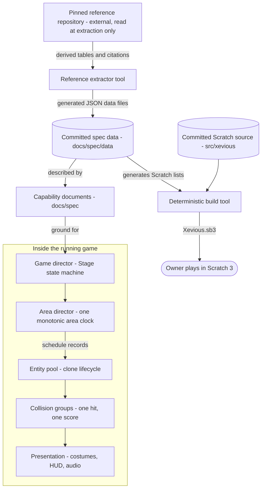

# Architecture

## Overview and context

The product is a Scratch 3 game: a single `.sb3` archive built deterministically from the committed Scratch
source (`src/xevious/project.json` plus assets) by the project's own build tool, and played by the owner in
Scratch 3 or TurboWarp. Gameplay data — area schedules, formations, difficulty tables, scores — derives from
one external source, the pinned `jotd666/xevious` reference repository, which is read only at extraction time
by a committed tool and never at build or run time. The boundary: everything the player experiences is built
here from committed files; the reference contributes derived numeric data and behavior rules, recorded under
`docs/spec/` with citations, never code, text, or media.

## The main parts

- **Reference extractor** (`tools/reference_extract.py`) — reads the pinned reference checkout, decodes its
  tables with an exact-consumption proof, and emits the committed JSON data files; refuses to run against
  bytes whose hashes differ from the pin.
- **Committed spec data** (`docs/spec/data/`) — the single normative home of bulk numeric data; both the
  spec prose and the build consume it, so there is exactly one transcription.
- **Deterministic build tool** (`tools/scratch_project.py` and generators) — turns committed Scratch source
  and data into the playable `.sb3`, reproducibly.
- **Game director** — the Stage is the sole writer of game state and owns every allowed transition; the
  complete state and edge set is normatively recorded in
  [core game systems](spec/core-game-systems.md).
- **Area director** — one monotonic scroll clock per area owns terrain position, schedule consumption,
  formation windows, boss windows, and the area 16-to-7 loop.
- **Entity pool** — clone-based enemies and projectiles share one spawn, update, hit, explode, remove
  lifecycle within Scratch's clone budget.
- **Collision groups** — blaster-to-air, bomb-to-ground, enemy-shot-to-player, air-enemy-to-player, and
  Bacura-to-player stay distinct; a hit resolves exactly once and cannot double-score.
- **Presentation** — costumes, animation timing, HUD, and audio stay separate from entity rules.

## How it behaves at runtime

The flow that matters most is one gameplay frame: the game director confirms the state is *playing*; the
area director advances its scroll clock and consumes every schedule record whose row matches, spawning
ground objects into their slots, adjusting formation and difficulty state, or driving boss and special
events; active entities update movement and firing; collision groups resolve, each hit exactly once,
awarding score through the single scoring path; presentation renders the result. The game's own frame
counter is the authoritative clock — the arcade runs at 60 frames per second, and every reference-derived
timing is recorded in arcade frames in the spec, with any conversion to Scratch's frame pacing recorded as
a port necessity where it cannot be matched exactly.

The second flow is a life: player hit → director enters *player-dead* (entities and inputs freeze under the
director's authority) → explosion presentation → *respawning* with the recorded reset scope → *playing*, or
*game-over* when no craft remains, then the cabinet flow (high-score entry when earned, back to attract).

## Key decisions

- **The Stage is the sole writer of game state.** One director owns transitions; sprites obey. Chosen over
  distributed per-sprite state, which made resets and edge cases untestable.
- **One transcription of bulk data, by tool.** Committed JSON generated by the extractor, consumed by spec
  and build alike. Chosen over hand-maintained tables in prose or Scratch lists, which drift.
- **Reference read at extraction time only.** The build and the game never touch the reference; the
  committed data files carry derived values, citation locators (symbol names and line numbers), and
  hashes. Chosen over vendoring the reference's content, which its license status forbids.
- **Centralized ordered update.** The Stage walks the object slots in index order each tick and clones
  render their slot's state — the shape that preserves the reference's random-stream draw order
  (recorded in [core game systems](spec/core-game-systems.md)). Chosen over free-running per-clone
  update threads, whose stepping order Scratch does not guarantee.
- **Timing recorded in arcade frames.** Reference timings keep their native unit in the spec; Scratch
  conversions are recorded deviations, not silent rescalings. Chosen over baking converted values into the
  spec, which would hide the fidelity gap.
- **Clone budget respected by design.** The entity pool plans for Scratch's clone limit; if one shared
  target proves unmaintainable, one target per behavior family keeps the same lifecycle and collision
  interfaces (measured by the planned clone/performance spike before enemy work begins).
- **A headless runtime tripwire now, on the official VM; Whisker later.** A small `harness/` runs the
  built `.sb3` in the official pinned `scratch-vm` — the engine stock Scratch 3 itself runs — and asserts
  on internal state variables and clone counts as a pre-playtest regression net, driving the sequencer by
  hand so one step is one tick. It observes the deterministic logic layer only: never rendered collision,
  visuals, audio, or feel, which stay the operator's playtest, and a green run reflects its pinned VM, not
  the exact runtime the operator plays. Chosen over the scratch-gui editor (the wrong layer, and archived)
  and over adopting se2p/whisker now (a forked, heavier VM one step further from stock Scratch 3, most of
  it unused for a fidelity restoration); Whisker stays a deliberate later step for block coverage and
  automated mutation analysis, on this same substrate. It is never a gameplay gate.
